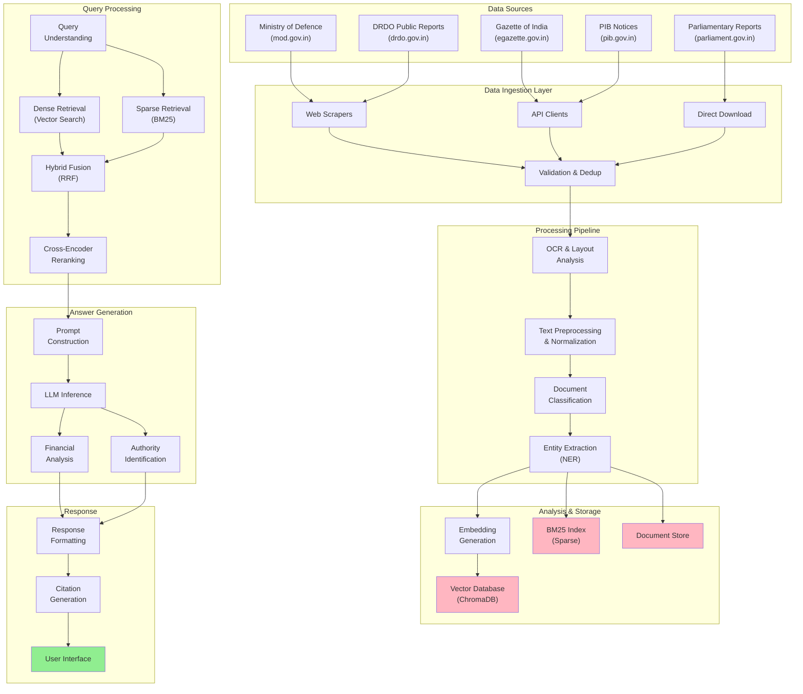
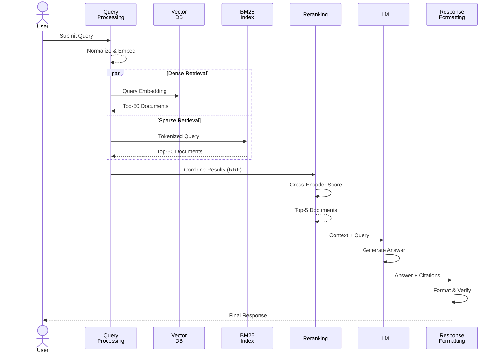
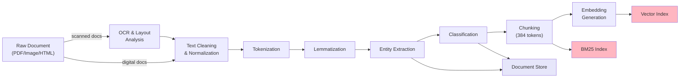
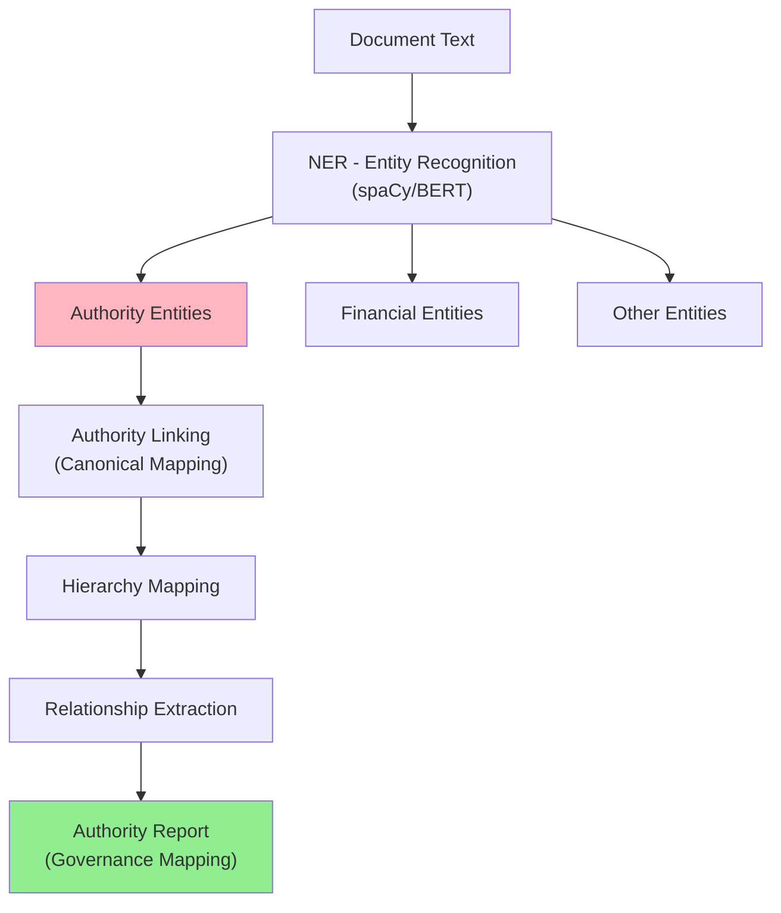
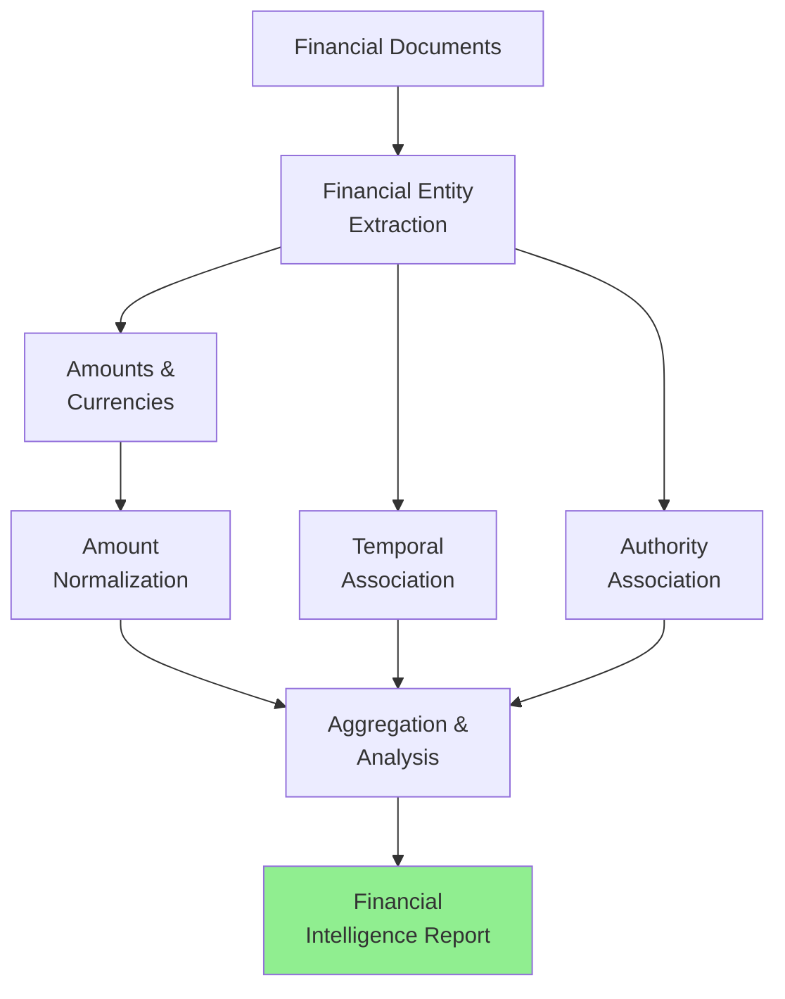
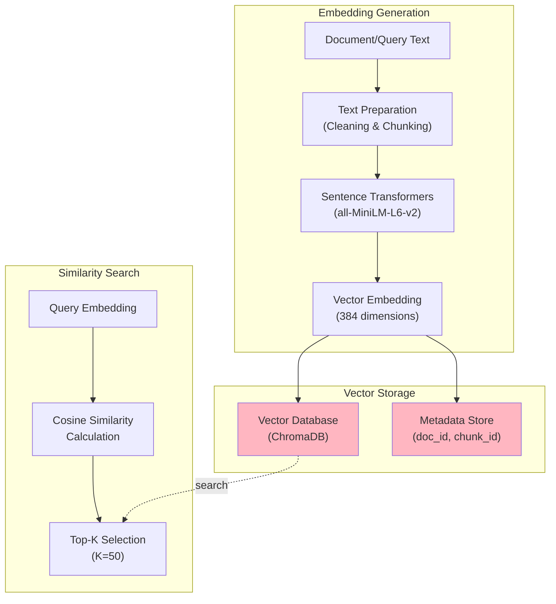
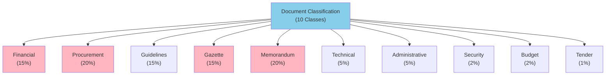
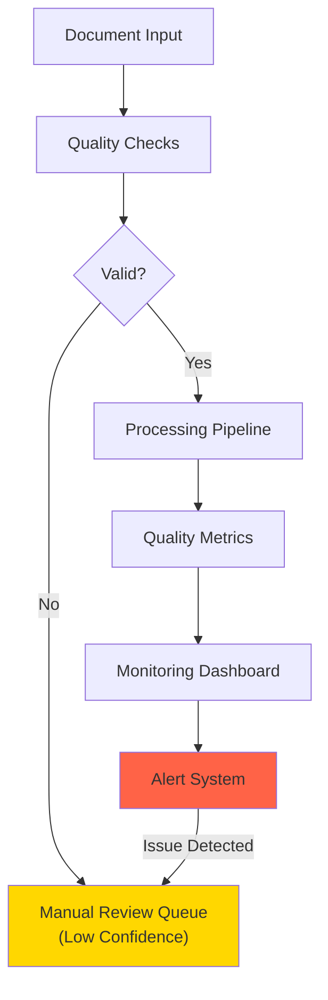
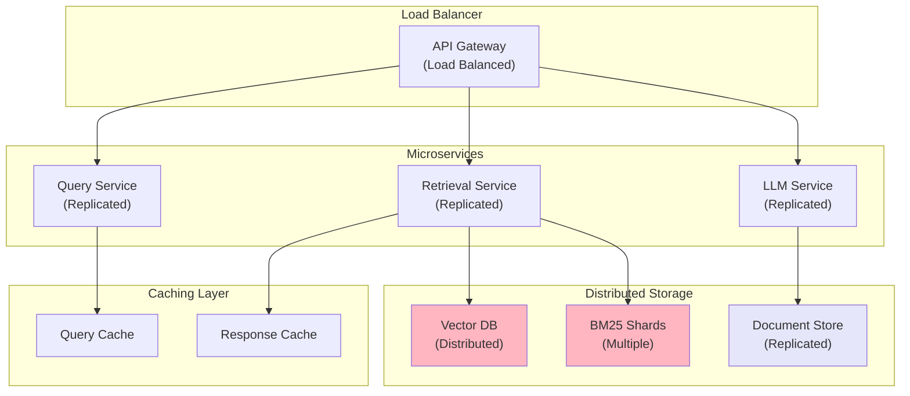
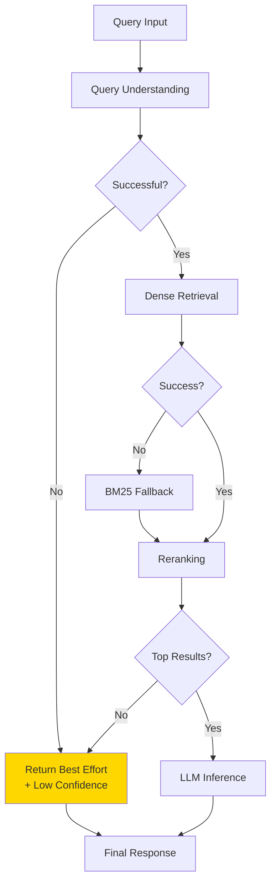

# System Architecture Diagrams

## Mermaid Diagrams for DIRAS Architecture

---

## 1. High-Level System Architecture

---

## 2. RAG Query Pipeline

---

## 3. Document Processing Pipeline

---

## 4. Entity Extraction & Authority Mapping

---

## 5. Financial Analysis Workflow

---

## 6. Embedding & Vector Search

---

## 7. Classification Hierarchy

---

## 8. Data Quality & Monitoring

---

## 9. Scalability Architecture (Phase 4+)

---

## 10. Error Handling & Fallback Paths

---

## Key Diagram Notes

1. **System Architecture**: Shows all major components and data flow
2. **RAG Pipeline**: Depicts query processing to response generation
3. **Processing Pipeline**: Document acquisition to indexing
4. **Entity Extraction**: Authority and relationship identification
5. **Financial Analysis**: Financial data extraction and analysis
6. **Embedding Pipeline**: Vector generation and storage
7. **Classification**: 10-class document categorization
8. **Monitoring**: Quality assurance and alerts
9. **Scalability**: Distributed architecture for Phase 4+
10. **Error Handling**: Fallback mechanisms for robustness

---

*Last Updated: May 26, 2026*
